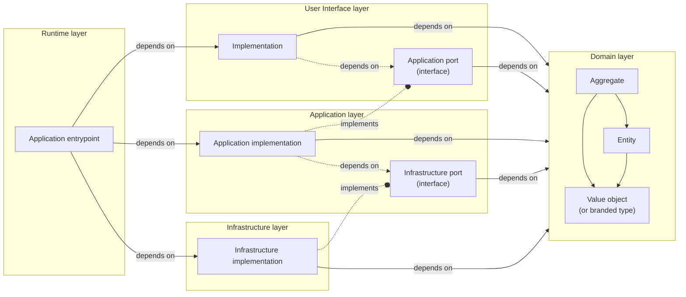

# Layered Architecture (kxphotographer)

This repository contains my view of a pragmatic layered architecture, distilled from Clean/Hexagonal principles and adapted for day-to-day application development.

---

# Overview

The project is organized into the following layers:

- Runtime
- Domain
- User Interface
- Application (Use Case)
- Infrastructure

## Dependency rules

- Runtime depends on the concrete implementations in the User Interface, Application, and Infrastructure layers.
- User Interface, Application, and Infrastructure depend on the Domain layer (never the other way around).
- The User Interface layer depends on the Application port (interface) — not a concrete implementation.
- The Application layer implements the Application port defined by the User Interface layer.
- The Application layer depends on Infrastructure ports (interfaces) defined within the Application layer.
- The Infrastructure layer implements the Infrastructure ports defined by the Application layer.

When the application runs end-to-end, the User Interface calls into the Application layer, and the Application layer calls into Infrastructure. However, compile-time dependencies point inward via ports (interfaces): lower-level details implement ports defined by higher-level policies. In other words, concrete Infrastructure depends on Application-defined ports, and concrete Application implementations depend on User-Interface-defined ports. This is a deliberate application of the [Dependency Inversion Principle](https://en.wikipedia.org/wiki/Dependency_inversion_principle).



---

# Runtime layer

This layer contains one or more entry point scripts that wire the application together. An entry point is responsible for instantiating concrete implementations from the User Interface, Application, and Infrastructure layers and resolving their dependencies so the whole system can run.

Typical responsibilities:
- Choose concrete adapters (e.g., which database implementation, which message bus client)
- Configure dependency injection or manual wiring
- Load configuration (env vars, CLI args)
- Start servers, workers, schedulers

---

# Domain layer

This layer defines the core business concepts and their rules. It captures:
- What values are valid and how they can change
- Which attributes a business concept has
- What constitutes a consistent state

Common building blocks:
- Aggregates: clusters of domain objects treated as a consistency boundary
- Entities: identifiable objects that change over time
- Value Objects: immutable values defined by their properties (can be branded/opaque types)

The Domain layer is pure and has no dependencies on other layers. It should be easy to unit test in isolation.

---

# User Interface layer

This layer adapts the outside world to the Application layer. It:
- Accepts input, validates and converts it into Domain types
- Invokes Application use cases via the Application port
- Presents results back to the caller (HTTP response, CLI output, RPC reply, etc.)

“User” is broad: it can be a browser, mobile app, CLI, cron job, or another service. This layer also defines the Application port (interfaces) that the Application layer must implement. That lets the UI depend only on behavior contracts, not concrete implementations.

---

# Application (Use Case) layer

This layer implements use cases and orchestrates the domain model and infrastructure through ports. It:
- Implements the Application port consumed by the User Interface layer
- Defines Infrastructure ports that express what it needs from external systems
- Coordinates domain objects and enforces application-specific policies (idempotence, permissions, invariants across aggregates)
- Establishes transaction boundaries without leaking technology choices

Because the Application layer defines its own Infrastructure ports, it can decide transactional boundaries and error semantics independent of the actual database or external services. The Infrastructure layer provides concrete adapters that implement these ports.

```ts
// Example: technology-agnostic transaction function type in TypeScript
// The Application layer defines this; Infrastructure implements it.
export type TransactionFunction<TransactionHandle> = <Result>(
  action: (tx: TransactionHandle) => Promise<Result>
) => Promise<Result>;
```

---

# Infrastructure layer

This layer communicates with external systems (databases, caches, object stores, external APIs, queues) and maps data to/from Domain types. It implements the Infrastructure ports defined in the Application layer and must not leak technology-specific details upward.

Typical responsibilities:
- Implement repositories, gateways, and transaction functions
- Handle retries, timeouts, circuit breakers at the edge
- Translate infrastructure errors into Application-level error types

Note: Infrastructure depends inward on the Domain and on the ports defined by the Application layer; the Domain never depends on Infrastructure.

---

# Putting it together: data flow example

1) A request reaches the User Interface (e.g., HTTP controller). It validates input and converts it to Domain types.
2) The UI calls the Application port (use case method) with the validated data.
3) The Application layer starts a transaction (via its transaction port), loads aggregates through repository ports, applies domain logic, and persists changes.
4) The Application returns a result DTO. The UI formats it for the caller.

This separation keeps business rules testable and stable even as frameworks, databases, or protocols change.
